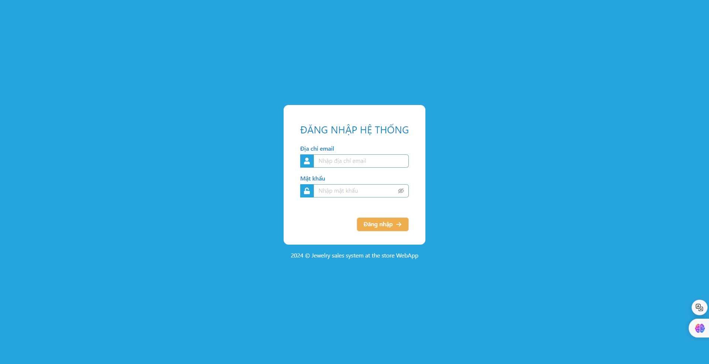
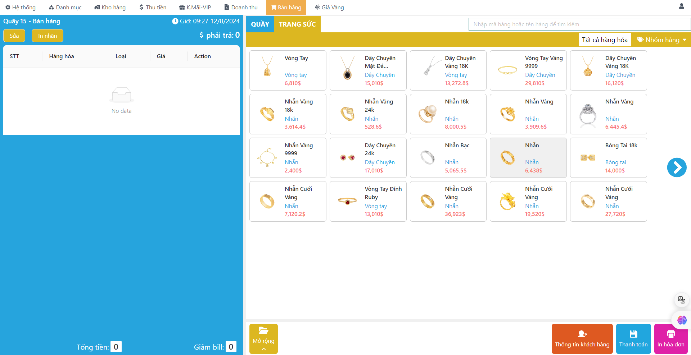
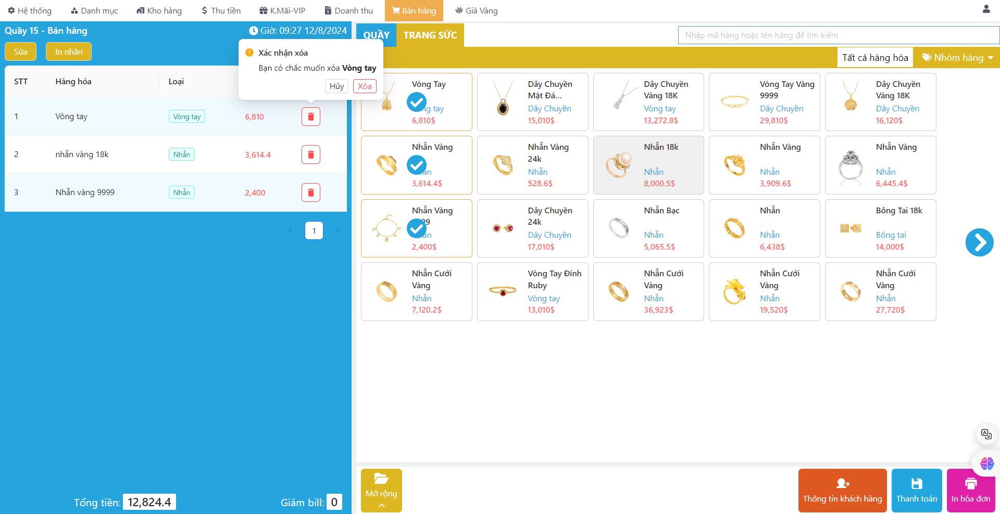
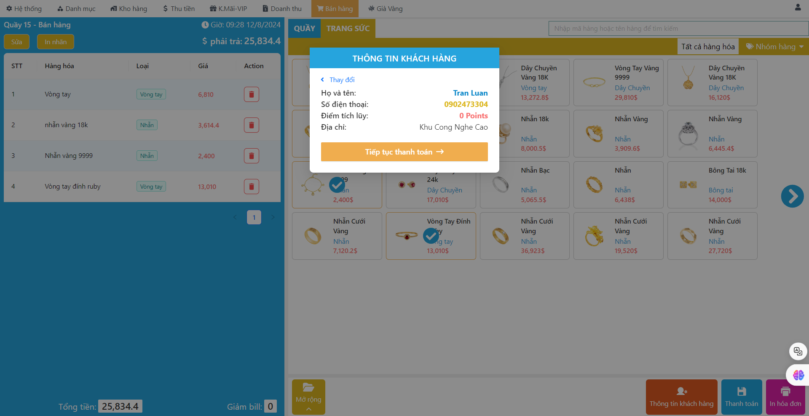
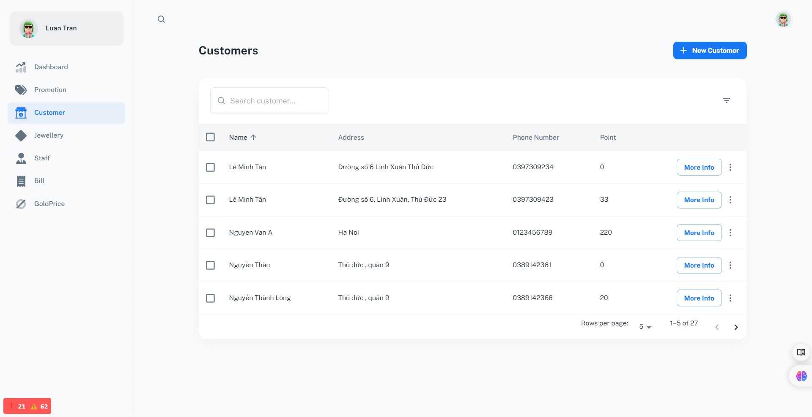
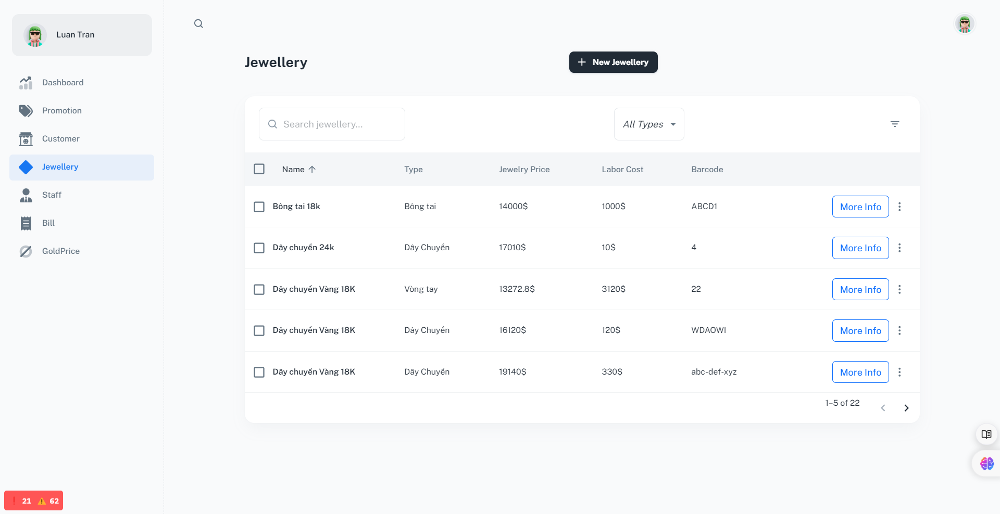
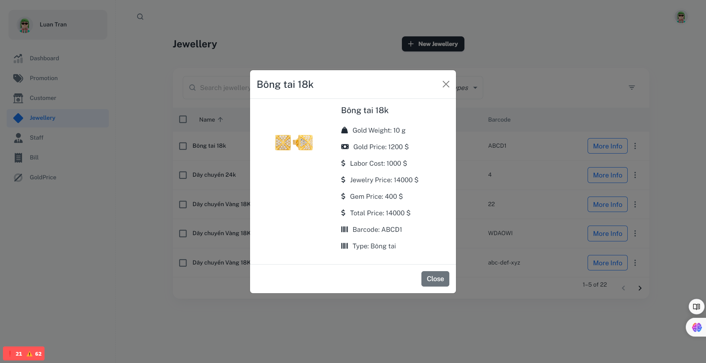

<!-- Improved compatibility of back to top link: See: https://github.com/othneildrew/Best-README-Template/pull/73 -->
<a id="readme-top"></a>
<!--
*** Thanks for checking out the Best-README-Template. If you have a suggestion
*** that would make this better, please fork the repo and create a pull request
*** or simply open an issue with the tag "enhancement".
*** Don't forget to give the project a star!
*** Thanks again! Now go create something AMAZING! :D
-->


<!-- PROJECT SHIELDS -->
<!--
*** I'm using markdown "reference style" links for readability.
*** Reference links are enclosed in brackets [ ] instead of parentheses ( ).
*** See the bottom of this document for the declaration of the reference variables
*** for contributors-url, forks-url, etc. This is an optional, concise syntax you may use.
*** https://www.markdownguide.org/basic-syntax/#reference-style-links
-->

[![Forks][forks-shield]][forks-url]
[![Stargazers][stars-shield]][stars-url]
[![Issues][issues-shield]][issues-url]
[![MIT License][license-shield]][license-url]
[![LinkedIn][linkedin-shield]][linkedin-url]
[](https://github.com/Jewelry-Sales-System-At-The-Store-SWP/BE/actions/workflows/main.yml)


<!-- PROJECT LOGO -->
<br />
<div align="center">
  <a href="https://github.com/ngckinhluan/Jewelry-Sale-System-At-The-Store">
    
  </a>

<h3 align="center">Jewelry Sales System At The Store</h3>

  <p align="center">
    This software is designed to manage the sales operations for a jewelry business with a single store that includes multiple counters.
    <br />
      <a href="https://github.com/ngckinhluan/JSSAT"><strong>Explore the docs »</strong></a>
    <br />
    <br />
     <a href="https://github.com/ngckinhluan/JSSAT">View Demo</a>
    ·
    <a href="https://github.com/ngckinhluan/JSSAT/issues">Report Bug</a>
    ·
    <a href="https://github.com/ngckinhluan/JSSAT/issues">Request Feature</a>
  </p>
</div>


<!-- TABLE OF CONTENTS -->
<details>
  <summary>Table of Contents</summary>
  <ol>
    <li>
      <a href="#about-the-project">About The Project</a>
      <ul>
        <li><a href="#built-with">Built With</a></li>
      </ul>
    </li>
    <li>
      <a href="#getting-started">Getting Started</a>
      <ul>
        <li><a href="#prerequisites">Prerequisites</a></li>
        <li><a href="#installation">Installation</a></li>
      </ul>
    </li>
    <li><a href="#usage">Usage</a></li>
    <li><a href="#roadmap">Roadmap</a></li>
    <li><a href="#contributing">Contributing</a></li>
    <li><a href="#license">License</a></li>
    <li><a href="#contact">Contact</a></li>
    <li><a href="#acknowledgments">Acknowledgments</a></li>
  </ol>
</details>


<!-- ABOUT THE PROJECT -->
## About The Project

### API Backend
The API backend serves as the core of the jewelry sales management system, handling all the business logic and database interactions. Below is a screenshot showcasing the API backend:

[![API Screenshot Backend][api-screenshot]](./images/api-be.png)

## Database Management

### ERD

### ARD


### Front-End Page

The front-end of the application is designed for staff and managers to manage jewelry sales efficiently. Here are some key pages:

- This is the entry point for staff to access the jewelry sales management system. Users must authenticate themselves to gain access to the system.



- Once logged in, staff are directed to the main page where they can manage jewelry sales. This page allows staff to browse through items and assist customers.



- Staff can select items that customers wish to purchase. The interface is designed to be intuitive, ensuring that the sales process is smooth and efficient.



- Staff can easily find and verify customer information, ensuring personalized service and accurate record-keeping.



- This dashboard provides managers and administrators with an overview of the jewelry inventory and sales performance. It is the central hub for managing the system.


- Managers can use this page to manage the jewelry inventory, including adding, updating, and removing items from the system.



- This page provides detailed information about individual jewelry items, allowing managers to make informed decisions regarding inventory management.




<p align="right">(<a href="#readme-top">back to top</a>)</p>


### Built With

* [![React][React.js]][React-url]
* [![.NET][.NET]][.NET-url]
* [![C#][C#]][.NET-url]
* [![Jira][Jira]][.NET-url]
* ![Visual Studio][Visual Studio]
* ![Supabase]
* ![Postgres]
* ![Jwt]
* ![TypeScript]
* ![MUI]
* ![Tailwind]
* ![Vercel]
* ![MongoDb]
* ![Nodejs]
* ![Js]
* ![React-router]


<p align="right">(<a href="#readme-top">back to top</a>)</p>


<!-- GETTING STARTED -->
## Getting Started

This is an example of how you may give instructions on setting up your project locally.
To get a local copy up and running follow these simple example steps.

### Prerequisites

This is an example of how to list things you need to use the software and how to install them.
* npm
  ```sh
  npm install npm@latest -g
  ```

### Installation
1. Clone the repo
   ```sh
   git clone https://github.com/ngckinhluan/Jewelry-Sale-System-At-The-Store.git
   ```
2. Frontend Setup
- Navigate to the front-end directory
  ```
  cd FE
  ```
3. Install NPM packages
   ```sh
   npm install
   ```
4. To start the development server and run the project locally, use the following command:
   ```
   npm run dev
   ```
5. Backend Setup
- Navigate to the backend directory
  ```
  cd BE
  ```
- Open the .sln file in your IDE (e.g., Visual Studio).
- Change the ConnectionString in the configuration file to match your database setup.
- Migrate the database to your local datbase machine
- Run the project
6. Now you can start using the project.

<p align="right">(<a href="#readme-top">back to top</a>)</p>

<!-- CONTRIBUTING -->
## Contributing

Contributions are what make the open source community such an amazing place to learn, inspire, and create. Any contributions you make are **greatly appreciated**.

If you have a suggestion that would make this better, please fork the repo and create a pull request. You can also simply open an issue with the tag "enhancement".
Don't forget to give the project a star! Thanks again!

1. Fork the Project
2. Create your Feature Branch (`git checkout -b feature/AmazingFeature`)
3. Commit your Changes (`git commit -m 'Add some AmazingFeature'`)
4. Push to the Branch (`git push origin feature/AmazingFeature`)
5. Open a Pull Request

<p align="right">(<a href="#readme-top">back to top</a>)</p>

## Members

A special thanks to the following team members for their invaluable contributions to this project:

- **Nguyen Hung Nghia (K16 HCM):** Backend development and database management
- **Le Minh Tan (K16 HCM):** Backend development
- **Tran Huy Hoang (K18 HCM):** Frontend development
- **Tran Ngoc Kinh Luan (K18 HCM):** Frontend development (me)

Your dedication and support made this project possible.

<!-- LICENSE -->
## License

Distributed under the MIT License. See `LICENSE.txt` for more information.

<p align="right">(<a href="#readme-top">back to top</a>)</p>

<!-- CONTACT -->
## Contact

Tran Ngoc Kinh Luan - [LinkedIn](https://www.linkedin.com/in/luantnk0729/) - luantnk2907@gmail.com

Project Link: [https://github.com/ngckinhluan/JSSAT](https://github.com/ngckinhluan/JSSAT)

<p align="right">(<a href="#readme-top">back to top</a>)</p>


<!-- MARKDOWN LINKS & IMAGES -->
<!-- https://www.markdownguide.org/basic-syntax/#reference-style-links -->
[contributors-shield]: https://img.shields.io/github/contributors/ngckinhluan/Jewelry-Sale-System-At-The-Store.svg?style=for-the-badge
[contributors-url]: https://github.com/ngckinhluan/JSSAT/graphs/contributors
[forks-shield]: https://img.shields.io/github/forks/ngckinhluan/Jewelry-Sale-System-At-The-Store.svg?style=for-the-badge
[forks-url]: https://github.com/ngckinhluan/JSSAT/network/members
[stars-shield]: https://img.shields.io/github/stars/ngckinhluan/Jewelry-Sale-System-At-The-Store.svg?style=for-the-badge
[stars-url]: https://github.com/ngckinhluan/JSSAT/stargazers
[issues-shield]: https://img.shields.io/github/issues/ngckinhluan/Jewelry-Sale-System-At-The-Store.svg?style=for-the-badge
[issues-url]: https://github.com/ngckinhluan/repo_name/issues
[license-shield]: https://img.shields.io/github/license/ngckinhluan/Jewelry-Sale-System-At-The-Store.svg?style=for-the-badge
[license-url]: https://github.com/ngckinhluan/Jewelry-Sale-System-At-The-Store/blob/main/LICENSE.txt
[linkedin-shield]: https://img.shields.io/badge/-LinkedIn-black.svg?style=for-the-badge&logo=linkedin&colorB=555
[linkedin-url]: https://linkedin.com/in/luantran0729
[api-screenshot]: images/api-be.png
[product-screenshot]: images/screenshot.png
[product-screenshot]: images/screenshot.png
[product-screenshot]: images/screenshot.png
[product-screenshot]: images/screenshot.png


[React.js]: https://img.shields.io/badge/React-20232A?style=for-the-badge&logo=react&logoColor=61DAFB
[React-url]: https://reactjs.org/

[.NET]: https://img.shields.io/badge/.NET-5C2D91?style=for-the-badge&logo=.net&logoColor=white
[.NET-url]:https://dotnet.microsoft.com/en-us/


[C#]: https://img.shields.io/badge/C%23-239120?style=for-the-badge&logo=c-sharp&logoColor=white
[C#-url]: https://learn.microsoft.com/en-us/dotnet/csharp/

[Jira]: https://img.shields.io/badge/Jira-0052CC?style=for-the-badge&logo=Jira&logoColor=white

[Visual Studio]:https://img.shields.io/badge/Visual_Studio-5C2D91?style=for-the-badge&logo=visual%20studio&logoColor=white

[Supabase]:https://img.shields.io/badge/Supabase-181818?style=for-the-badge&logo=supabase&logoColor=white

[Postgres]:https://img.shields.io/badge/PostgreSQL-316192?style=for-the-badge&logo=postgresql&logoColor=white

[TypeScript]:https://img.shields.io/badge/TypeScript-007ACC?style=for-the-badge&logo=typescript&logoColor=white

[Tailwind]:https://img.shields.io/badge/Tailwind_CSS-38B2AC?style=for-the-badge&logo=tailwind-css&logoColor=white

[MUI]:https://img.shields.io/badge/Material--UI-0081CB?style=for-the-badge&logo=material-ui&logoColor=white

[Vercel]:https://img.shields.io/badge/Vercel-000000?style=for-the-badge&logo=vercel&logoColor=white

[MongoDb]:https://img.shields.io/badge/MongoDB-4EA94B?style=for-the-badge&logo=mongodb&logoColor=white

[Nodejs]: https://img.shields.io/badge/Node.js-43853D?style=for-the-badge&logo=node.js&logoColor=white

[Js]: https://img.shields.io/badge/JavaScript-323330?style=for-the-badge&logo=javascript&logoColor=F7DF1E

[React-router]: https://img.shields.io/badge/React_Router-CA4245?style=for-the-badge&logo=react-router&logoColor=white

[Jwt]: https://img.shields.io/badge/json%20web%20tokens-323330?style=for-the-badge&logo=json-web-tokens&logoColor=pink